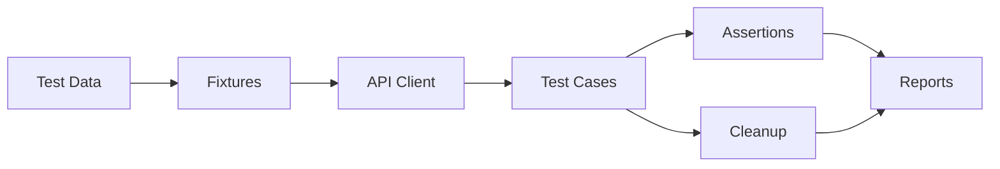

<div align="center">

# BYSMS API Test Framework

**Run a complete API regression suite with one command using pytest and requests.**

[English](./README.md) | [简体中文](./README.zh-CN.md)

[](https://python.org)
[](https://pytest.org)
[](#-reports)
[](./LICENSE)

</div>

---

## 🎯 What it is

A layered API automation framework for a sales-management system.

It focuses on the repetitive parts of regression testing:

- authentication handling
- CRUD coverage
- reusable request helpers
- generated test data
- cleanup after execution
- smoke / module-based execution
- parallel runs
- HTML / Allure reporting

---

## ⚡ Quick Start

```bash
git clone https://github.com/Dream22180971/BaiyueMedicalSalesSystemTest.git
cd BaiyueMedicalSalesSystemTest

python -m venv venv
# Windows: venv\Scripts\activate
# Linux/macOS: source venv/bin/activate

pip install -r requirements.txt
cp .env.example .env
python run_tests.py
```

Edit `.env` for your target environment before running.

```env
BASE_URL=http://127.0.0.1:8047
API_PREFIX=/api/mgr
ADMIN_USERNAME=byhy
ADMIN_PASSWORD=88888888
```

---

## 🛠 Common Commands

```bash
python run_tests.py --type smoke
python run_tests.py --type customer
python run_tests.py --parallel
python run_tests.py --report html
python run_tests.py --report allure
```

---

## 🧪 Test Design



The framework separates configuration, request code, fixtures, test cases and reporting so changes remain localized.

---

## ✅ Coverage

| Area | Examples |
|---|---|
| Authentication | valid / invalid login, session handling |
| Customer | create, query, update, delete, pagination |
| Product / medicine | CRUD and boundary data |
| Orders | creation and business-flow validation |
| Search | filters, pagination and invalid parameters |
| Regression | smoke and broader suites |

---

## 📊 Reports

The dependency stack includes:

- `pytest-html`
- `allure-pytest`
- `pytest-xdist` for parallel execution
- rerun and timeout plugins
- console reporting

---

## 🧩 Engineering Structure

The project is designed as a reusable framework rather than a folder of independent scripts.

Key ideas:

- fixture-managed setup / teardown
- environment-driven configuration
- deterministic cleanup
- reusable HTTP layer
- selectable test suites
- CI-friendly commands

---

## ⚠️ Current Limitations

- reliability still depends on the target test environment
- credentials in `.env` should never be committed
- parallel execution requires isolated test data
- production teams should add secret management and CI environment separation

---

## 🤝 Contributing

Useful contributions include stronger test-data isolation, richer assertions, CI examples and additional module coverage.

---

## 📄 License

[MIT](./LICENSE)

<div align="center">

**A test framework is useful when adding the next test is easier than writing the first one.**

</div>
