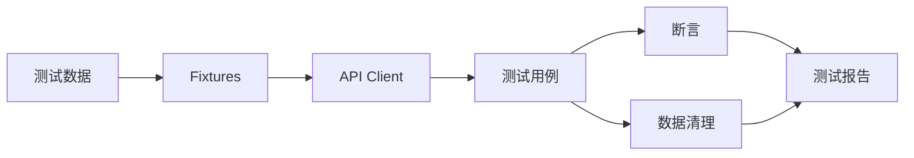

<div align="center">

# BYSMS 接口自动化测试框架

**基于 pytest + requests，一条命令运行完整 API 回归测试。**

[English](./README.md) | [简体中文](./README.zh-CN.md)

[](https://python.org)
[](https://pytest.org)
[](#-测试报告)
[](./LICENSE)

</div>

---

## 🎯 它是什么

一个面向销售管理系统的分层 API 自动化测试框架。

重点解决接口回归里最重复的部分：

- 登录态处理
- CRUD 覆盖
- 请求封装
- 测试数据生成
- 执行后数据清理
- 冒烟 / 模块化执行
- 并行运行
- HTML / Allure 报告

---

## ⚡ 5 分钟快速开始

```bash
git clone https://github.com/Dream22180971/BaiyueMedicalSalesSystemTest.git
cd BaiyueMedicalSalesSystemTest

python -m venv venv
# Windows: venv\Scripts\activate
# Linux/macOS: source venv/bin/activate

pip install -r requirements.txt
cp .env.example .env
python run_tests.py
```

运行前根据目标测试环境修改 `.env`。

```env
BASE_URL=http://127.0.0.1:8047
API_PREFIX=/api/mgr
ADMIN_USERNAME=byhy
ADMIN_PASSWORD=88888888
```

---

## 🛠 常用命令

```bash
python run_tests.py --type smoke
python run_tests.py --type customer
python run_tests.py --parallel
python run_tests.py --report html
python run_tests.py --report allure
```

---

## 🧪 测试设计



环境配置、请求代码、Fixture、测试用例和报告分开管理，减少修改扩散。

---

## ✅ 覆盖范围

| 模块 | 示例 |
|---|---|
| 登录鉴权 | 正常 / 异常登录、会话处理 |
| 客户管理 | 新增、查询、修改、删除、分页 |
| 药品 / 产品 | CRUD 与边界数据 |
| 订单 | 创建与业务流校验 |
| 搜索 | 筛选、分页、非法参数 |
| 回归 | 冒烟与完整回归集合 |

---

## 📊 测试报告

当前依赖包含：

- `pytest-html`
- `allure-pytest`
- `pytest-xdist` 并行执行
- rerun / timeout 插件
- 控制台报告

---

## 🧩 工程结构

它不是一堆互不关联的测试脚本，而是一个可持续扩展的测试框架。

核心工程点：

- Fixture 管理 Setup / Teardown
- 环境变量驱动配置
- 可预测的数据清理
- 复用 HTTP 请求层
- 可选择测试集合
- 适合接入 CI 的命令入口

---

## ⚠️ 当前限制

- 测试稳定性仍然依赖被测环境
- `.env` 中的凭据不应提交到仓库
- 并行执行要求测试数据互相隔离
- 真实生产团队应增加 Secret 管理和 CI 环境隔离

---

## 🤝 参与贡献

欢迎改进测试数据隔离、断言、CI 示例和更多业务模块覆盖。

---

## 📄 License

[MIT](./LICENSE)

<div align="center">

**好的测试框架，应该让写下一条用例比写第一条更容易。**

</div>
